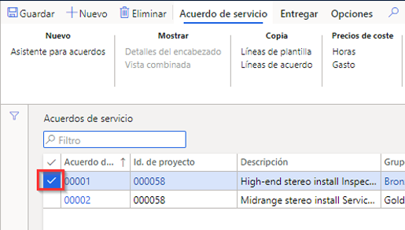
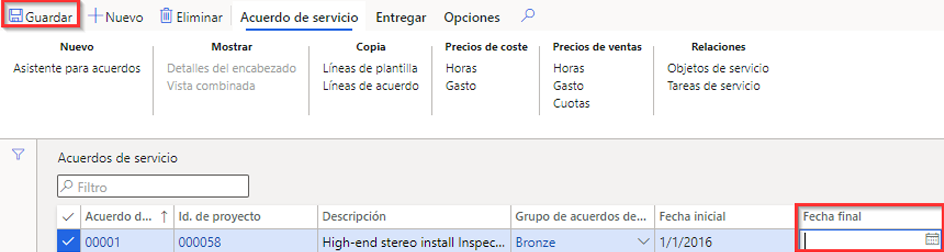

---
lab:
    title: 'Laboratorio 7: Crear un pedido de trabajo planificado'
    module: 'Módulo 1: Aprender los fundamentos de Microsoft Dynamics 365 Supply Chain Management'
---

## Laboratorio 7: Crear un pedido de trabajo planificado

## Objetivos

Pedidos de mantenimiento introducidos en el sistema que describen el mantenimiento o la reparación que debe realizarse en el activo y asignan los recursos apropiados para completar la solicitud de mantenimiento. Su empresa tiene un contrato de servicio en curso y necesita asegurarse de que se crean pedidos de servicio planificados para respaldar el servicio previsto de los artículos del contrato.

## Configuración del laboratorio

   - **Tiempo estimado**: 10 minutos

## Instrucciones

1. En la página de inicio de Finance and Operations, en la parte superior derecha, compruebe que esté trabajando con la empresa USMF.

1. Si es necesario, seleccione la empresa y, en el menú, seleccione **USMF.**

1. En el panel de navegación izquierdo, seleccione **Módulos** > **Administración de servicio** > **Acuerdos de servicio** > **Acuerdos de servicio**.

1. Seleccione el cuadro de la primera columna del primer acuerdo de servicio.

    

1. Seleccione el cuadro **Fecha final**, elimine el valor actual y luego, en el menú superior, elija **Guardar**.  
 La fecha final se quita para poder crear un nuevo pedido de servicio para este acuerdo.

    

1. En el menú superior, seleccione **Entregar**.

1. En la barra de la cinta, en **Crear**, seleccione **Pedidos de servicio planificados**.

1. En el panel Crear pedidos de servicio, en **PERÍODO**, seleccione **Fecha desde** con el valor de la fecha actual y la **Fecha hasta** a dos días de la fecha actual.

1. En **REGISTRO DE INFORMACIÓN**, seleccione el conmutador de alternancia **Mostrar registro de información** y establézcalo en **Sí**.  
Esto mostrará una lista de los pedidos de servicio que se crean en el contrato.

1. En **INCLUIR TIPOS DE TRANSACCIÓN**, seleccione el conmutador de alternancia **Horas** y establézcalo en **Sí**.  
Los tipos de transacción representan las líneas que se crean en el acuerdo de servicio, y cada tipo de transacción que se selecciona genera varios pedidos de servicio, según el intervalo de servicio que se especifique en la línea del acuerdo de servicio.

1. En **OPCIÓN**, seleccione el conmutador de alternancia **Continuo** y establézcalo en **Sí**.  
Se utiliza para crear los pedidos de servicio que faltan en una serie continua de pedidos de servicio.

1. Seleccione **Aceptar**.
